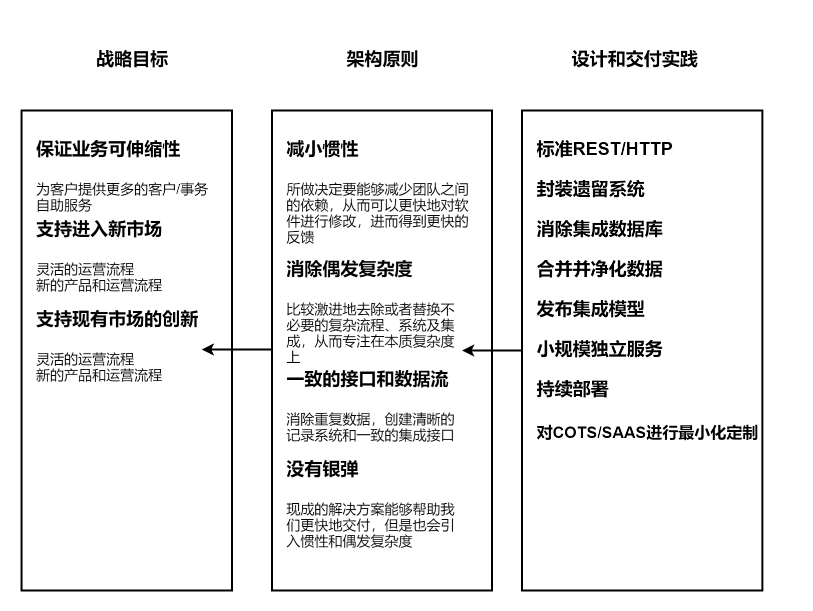

# 2.4 一个原则的方法

基于要达到的目标去定义一些原则和实践对做设计来说非常有好处。

### 2.4.1 战略目标

这些都是你的组织前进的方向，所以需要确保技术层面的选择能够与之一致。

### 2.4.2 原则

为了和更大的目标保持一致，我们会制定一些具体的规则，并称之为原则，它不是一成不变的。

举个例子，如果组织的一个战略目标是缩短新功能上线的周期，那么一个可能的原则是，交付团队应该对整个软件生命周期有完全的控制权，这样他们就可以及时交付任何就绪的功能项，而不受其他团队的限制。如果组织的另一个目标是在其他国家快速增长业务，你需要的原则可能就是，整个系统必须能够方便地部署到相应的国家，从而符合该国家对数据存储地理位置方面的要求。

很有可能这些原则并不适合你的组织。一般来讲，原则最好不要超过10个，或者能够写一张海报上，不然大家会很难记住。而且原则越多，它发生重叠和冲突的可能性就越大。

### 2.4.3 实践

我们通过相应实践来保证原则能够得到实施，这些实践能够知道我们如何完成任务。通常这些实践是技术相关的，而且是比较底层的，所以任何一个开发人员都能够理解。这些实践包括代码规范、日志数据集中捕获或者HTTP/REST作为标准集成风格等。由于实践比较偏技术层面，所以其实改变的频率高于原则。

实践应该巩固原则。

### 2.4.4 将原则和实践相结合

​有些东西对一些人来说是原则，对另一些人来说则可能是实践。比如，你可能会把使用HTTP/REST作为原则，而不是实践。这也没什么问题，关键是要有一些重要的原则来指导系统的演化，同时也要有一些细节来指导如何实现这些原则。对于一个足够小的群组，比如当团队来说，将原则和实践进行结合是没有问题的。但是在一个大型组织中，技术和工作实践可能不一样，在不同的地方需要的实践的可能也不同。不过这也没关系，只要它们都能够映射到相同的原则即可。比如一个。NET团队可能有一套实践，一个Java团队有另一套实践，但背后的原则是相同的。

### 2.4.5 真实世界的样子

该图很清楚地显示了目标、原则和实践之间的相互影响。几年间，实践改变的很频繁，而原则基本上没怎么变。
